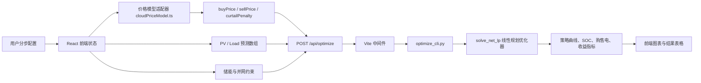

# 云平台动态电价配置与储能优化功能说明书

## 1. 文档目的

本文档说明云平台“动态电价配置向导”和储能优化模型的功能边界、业务原因、用户配置流程、参数定义、价格计算逻辑、优化器计算逻辑、输出结果和验收要点。

本文档面向产品、算法、前端、后端、测试和实施人员。目标是让项目中的每个角色都能理解：

- 为什么云平台不能只让用户选择价格模板，还必须配置市场电价来源、能量流向价格规则和求解边界。
- 用户在界面上每一步配置的参数会如何转成模型输入。
- 前端价格模型如何转换成优化器当前支持的 `buyPrice`、`sellPrice` 和 `curtailPenalty`。
- 后端线性规划优化器如何根据价格、光伏预测、负荷预测、储能参数和并网边界计算最优充放电策略。

## 2. 功能背景与建设原因

动态电价场景下，储能收益不是由一个固定电价决定，而是由多个因素共同决定：

- 不同市场、不同省份、不同交易品种的电价曲线不同。
- 同一个电站内部存在多种能量流向，例如电网到负荷、光伏到负荷、光伏到储能、储能到电网等。
- 光伏自用、储能充放电、上网收益、弃光惩罚和需量控制的业务含义不同，不能用一个“价格模板”完全表达。
- 储能策略必须满足 SOC、容量、充放电功率、购电上限、外送上限、需量软上限等约束。
- 用户需要按业务习惯逐步配置，而不是直接输入底层 96 点价格数组。

因此，云平台使用分步配置向导，将复杂模型拆成用户能理解的配置过程：

1. 绑定数据源。
2. 配置电站价格模型。
3. 配置求解器边界参数。
4. 选择优化目标。
5. 配置策略生成与下发方式。
6. 预览并运行策略。

## 3. 系统范围

### 3.1 当前已实现范围

当前原型已实现以下能力：

- React/Vite 前端分步配置向导。
- 动态电价价格模板选择。
- 市场电价来源选择，例如广东日前、广东实时、山东日前、Excel 导入、手动维护价格曲线等。
- 市场电价时间粒度选择：`5分钟`、`15分钟`、`30分钟`、`1小时`。
- 能量流向价格矩阵配置。
- 价格异常处理，包括允许负价、负价按 0、负价需确认。
- 储能容量、SOC、功率、效率、购售电和需量约束配置。
- 收益最大、绿电消纳、需量控制、综合优化目标配置。
- 日前策略、滚动优化、实时修正兜底配置。
- 配置 JSON 导出。
- 前端调用本地优化器 `/api/optimize`，生成策略结果。

### 3.2 当前未完全接入范围

以下能力在原型中保留了配置入口或数据结构，但还没有接入真实生产系统：

- 真实市场电价 API 拉取。
- Excel 电价文件上传、解析和校验。
- 手动维护价格曲线的完整编辑器。
- 将完整能量流向价格矩阵直接传入后端优化器。
- 策略真正下发到 EMS/PCS/BMS 控制系统。
- 多站点、多用户权限、审批流和审计日志。

当前优化器仍是双曲线接口，即使用一条买价曲线 `buyPrice` 和一条卖价曲线 `sellPrice` 进行计算。前端会把更丰富的能量流向价格矩阵转换成当前优化器可理解的双价格曲线。

## 4. 整体运行架构



本地开发时，前端请求路径为：

```text
POST /api/optimize
```

Vite 中间件会启动：

```text
../.venv/bin/python3 ../optimize_cli.py
```

`optimize_cli.py` 负责读取 JSON 请求、校验为 `OptimizeRequest`，然后调用 `optimizer_server_market_soft_demand.py` 中的 `solve_net_lp()`。

## 5. 用户功能流程

### 5.1 步骤 1：功率来源设置

目的：明确模型使用哪些测点或预测点位。

配置内容：

| 参数 | 含义 | 当前默认/示例 |
|---|---|---|
| 负荷功率数据源 | 电站负荷功率点位，负荷用电为正 | `Load_P_Total_kW` |
| 光伏功率数据源 | 光伏发电功率点位，发电为正 | `PV_P_Total_kW` |
| 储能功率数据源 | 储能功率点位，放电为正、充电为负 | `BESS_P_Total_kW` |
| 并网点功率数据源 | 并网点功率点位，购电为正、外送为负 | `Grid_PCC_Power` |
| 储能 SOC 数据源 | 储能 SOC 点位 | `BESS_SOC_Avg` |
| 数据刷新周期 | 云平台读取实时点位的刷新周期 | `1秒`、`5秒`、`15秒`、`1分钟` |

计算原因：

- 光伏预测和负荷预测是优化器的基本输入。
- 储能功率和 SOC 用于实时修正、越界保护和策略执行校验。
- 并网点功率用于购电/外送约束和需量控制。

### 5.2 步骤 2：电站价格模型

目的：定义“不同能量流向在经济上如何计价”。

价格模板只用于初始化推荐规则，不应该限制用户继续配置。用户可以选择模板后，继续修改市场来源、负价策略和每条能量流向的计价规则。

#### 5.2.1 价格模板

| 模板 | 含义 | 适用场景 |
|---|---|---|
| 市场联动折扣 | 部分流向跟随市场电价，并设置折扣或价差 | 现货市场、绿电/储能参与市场收益测算 |
| 工商业分时 | 使用固定峰平谷分时价格 | 工商业电费优化、削峰填谷 |
| 一口价/PPA | 使用固定合同价格 | PPA、固定售电合同、内部结算 |

#### 5.2.2 市场电价来源

配置项：

| 参数 | 含义 | 当前可选值 |
|---|---|---|
| 市场电价来源 | 指明市场价取自哪个市场或维护方式 | 广东日前、广东实时、山东日前、山西日前、蒙西实时、浙江工商业分时模板、Excel 导入日前价格、手动维护价格曲线 |
| 时间粒度 | 市场电价曲线的数据分辨率 | `5分钟`、`15分钟`、`30分钟`、`1小时` |
| 时区 | 电价曲线解释使用的时区 | `Asia/Shanghai` |

为什么必须配置市场电价来源：

- “市场价折扣”和“市场价+价差”这两类规则需要知道基准市场价格来自哪里。
- 不同省份和交易品种的价格峰谷、负价、尖峰时刻不同，直接影响储能充放电结果。
- Excel 导入和手动维护价格曲线属于非实时市场 API 场景，但同样需要进入统一价格模型。
- 后续生产版本需要用该字段决定调用哪个市场价格服务、哪张价格表或哪个用户维护曲线。

当前原型说明：

- 界面已记录市场来源和粒度，并写入导出的配置 JSON。
- 当前计算仍使用内置样例市场曲线作为 `market` 基准价。
- 后续接真实数据时，应将 `marketPriceSource + marketGranularity + timezone` 映射到真实价格曲线。

#### 5.2.3 能量流向价格矩阵

系统定义 8 个能量流向：

| FlowKey | 中文名称 | 业务含义 |
|---|---|---|
| `grid_to_load` | 电网 -> 负荷 | 外购电成本 |
| `grid_to_bess` | 电网 -> 储能 | 电网给储能充电的成本 |
| `pv_to_load` | 光伏 -> 负荷 | 光伏自用价值 |
| `pv_to_bess` | 光伏 -> 储能 | 光伏给储能充电的机会成本 |
| `pv_to_grid` | 光伏 -> 电网 | 光伏上网收益 |
| `bess_to_load` | 储能 -> 负荷 | 储能放电替代购电收益 |
| `bess_to_grid` | 储能 -> 电网 | 储能上网收益 |
| `curtailment` | 弃光惩罚 | 弃光机会成本或绿电消纳惩罚 |

每个流向的规则字段如下：

| 字段 | 类型 | 含义 |
|---|---|---|
| `mode` | `fixed`、`tou`、`discount`、`spread`、`same` | 计价模式 |
| `base` | `market`、`tou`、`fixed`、`same` | 基准价格来源 |
| `fixed` | number | 固定价，单位元/kWh |
| `factor` | number | 系数，用于折扣或倍率 |
| `offset` | number | 价差，单位元/kWh |
| `min` | number/null | 价格下限 |
| `max` | number/null | 价格上限 |
| `ref` | FlowKey/null | 当 `mode=same` 时引用的流向 |
| `allowNeg` | boolean | 是否允许该流向价格为负 |

#### 5.2.4 计价模式说明

| 模式 | 公式 | 说明 |
|---|---|---|
| 固定一口价 `fixed` | `price = fixed` | 不随时间变化 |
| 分时电价 `tou` | `price = tou(hour) * factor + offset` | 使用内置峰平谷曲线 |
| 市场价折扣 `discount` | `price = market(hour) * factor + offset` | 跟随市场价并乘以折扣系数 |
| 市场价+价差 `spread` | `price = market(hour) + offset` | 跟随市场价并加固定价差 |
| 等同价 `same` | `price = price(ref)` | 与另一个流向价格一致 |

最终价格还会经过下限、上限和负价策略处理。

#### 5.2.5 负价策略

| 策略 | 含义 | 计算影响 |
|---|---|---|
| 允许负价 | 市场负价可以直接参与计算 | 保留负价格 |
| 负价按 0 | 市场负价或流向负价被截断为 0 | `price = max(price, 0)` |
| 负价需确认 | 当前仍可预览，但提示自动下发前需要人工确认 | 当前原型发出 warning |

### 5.3 步骤 3：求解器边界参数

目的：设置储能和并网约束，使策略既有收益又可执行。

| 参数 | 单位 | 含义 | 校验/处理 |
|---|---:|---|---|
| 储能总容量 `totalCapacityKWh` | kWh | 电池可用总容量 | 必须大于 0 |
| 当前 SOC `currentSocPct` | % | 优化开始时 SOC | 限制在 0 到 100 |
| SOC 最小 `socMinPct` | % | 运行过程中 SOC 下限 | 应小于 SOC 最大 |
| SOC 最大 `socMaxPct` | % | 运行过程中 SOC 上限 | 应大于 SOC 最小 |
| 最大充电功率 `maxChargePowerKW` | kW | 每时段最大充电功率 | 不能小于 0 |
| 最大放电功率 `maxDischargePowerKW` | kW | 每时段最大放电功率 | 不能小于 0 |
| 往返效率 `etaRoundTrip` | 0 到 1 | 电池充放电往返效率 | 0 < eta <= 1 |
| 期末 SOC 下限 `endSocTargetPct` | % | 优化结束时 SOC 不低于该值 | 不应低于 SOC 最小 |
| 优化步长 `dtMinutes` | 分钟 | 每个优化点代表的时间 | 当前建议 15 分钟，96 点为一天 |
| 外送上限 `exportLimitKW` | kW | 并网点最大外送功率 | 空表示不限制 |
| 购电上限 `importLimitKW` | kW | 并网点最大购电功率 | 空表示不限制 |
| 需量软上限 `demandLimitKW` | kW | 期望购电不超过的上限 | 可超限，但会被惩罚 |
| 分时需量上限 `demandLimitSeriesKW` | kW 数组 | 每个时段独立的需量上限 | 长度必须等于价格数组长度 |
| 超限惩罚 `demandViolationCostPerKWh` | 元/kWh | 超过需量软上限的惩罚 | 越大越不愿超限 |
| 循环惩罚 `cycleCostPerKWh` | 元/kWh | 电池吞吐惩罚 | 用于抑制无意义充放电 |
| 弃光惩罚 `curtailPenalty` | 元/kWh | 弃光机会成本 | 绿电目标会自动提高最低惩罚 |

### 5.4 步骤 4：电站优化目标

| 目标 | 业务含义 | 当前实现方式 |
|---|---|---|
| 收益最大 | 低价充电、高价放电，减少净电费 | 以优化器净电费最小为核心 |
| 绿电消纳 | 提高光伏自用和储能消纳，减少弃光 | 提高弃光惩罚下限 |
| 需量控制 | 削峰，降低购电尖峰或需量超限 | 使用需量软上限和超限惩罚 |
| 综合优化 | 按收益、绿电、需量权重组合 | 当前记录权重，并用于配置导出；核心求解仍由惩罚项近似 |

综合优化权重要求合计为 100%。

### 5.5 步骤 5：策略生成与下发

| 模式 | 参数 | 含义 |
|---|---|---|
| 日前策略 | 生成时间 | 每天固定时间生成未来策略 |
| 日前策略 | 策略周期 | 未来 24 小时或 48 小时 |
| 日前策略 | 下发方式 | 自动下发、人工确认、只生成不下发 |
| 滚动优化 | 优化周期 | 每 5、15、30、60 分钟重算 |
| 滚动优化 | 滚动窗口 | 未来 6、12、24、48 小时 |
| 滚动优化 | 下发方式 | 每次重算下发、偏差超限下发、人工确认 |

实时修正兜底项：

- SOC 越界。
- 并网限制。
- 设备降额。
- 价格异常。

当前原型记录这些配置并导出 JSON，但策略下发和实时修正闭环未接入真实设备。

### 5.6 步骤 6：策略预览与执行

用户点击“生成并运行策略”后，系统会：

1. 校验所有步骤的必要参数。
2. 从 PV/负荷预测数组读取未来时段数据。
3. 通过价格模型适配器生成 `buyPrice`、`sellPrice` 和 `curtailPenalty`。
4. 组装优化器请求。
5. 调用 `/api/optimize`。
6. 展示收益指标、策略曲线和每时段结果表。

## 6. 价格模型计算逻辑

### 6.1 基准曲线

当前原型内置两类 24 小时基准曲线：

- `SAMPLE_MARKET_24`：样例市场电价曲线，包含负价。
- `SAMPLE_TOU_24`：样例工商业分时电价曲线。

每个优化点根据 `dtMinutes` 映射到小时：

```text
hour = floor(pointIndex * dtMinutes / 60) mod 24
```

如果未来接入真实市场价格服务，应把 `marketPriceSource`、`marketGranularity` 和 `timezone` 解析为实际价格序列，再按优化步长重采样。

### 6.2 单个流向价格计算

对于某个流向 `key`，系统读取对应的 `FlowRule`。

计算伪代码：

```text
if mode == fixed:
  value = fixed
else if mode == same:
  value = price(ref)
else:
  base = basePrice(base, hour)
  if mode == spread:
    value = base + offset
  else:
    value = base * factor + offset

if negativePolicy == clamp_zero or allowNeg == false:
  value = max(value, 0)

if min is number:
  value = max(value, min)

if max is number:
  value = min(value, max)

price = round(value, 3)
```

### 6.3 价格矩阵到优化器输入的转换

当前优化器只支持：

- `buyPrice`：买电价格曲线。
- `sellPrice`：卖电价格曲线。
- `curtailPenalty`：弃光惩罚。

前端适配逻辑如下：

```text
buyPrice = flowSeries.grid_to_load
sellPrice = min(flowSeries.pv_to_grid, flowSeries.bess_to_grid)
curtailPenalty = average(flowSeries.curtailment)
```

这样做的原因：

- `grid_to_load` 最接近用户从电网购电的真实成本。
- `pv_to_grid` 和 `bess_to_grid` 都可能产生上网收益，当前双曲线接口无法区分来源，因此取二者较低值作为保守卖价。
- `curtailment` 代表每 kWh 弃光的机会成本或惩罚，取平均值传给当前优化器。

目标对弃光惩罚的影响：

```text
if objective == green:
  curtailPenalty = max(meanCurtailment, 0.12)
else if objective == hybrid:
  curtailPenalty = max(meanCurtailment, 0.06)
else:
  curtailPenalty = meanCurtailment
```

### 6.4 默认模板规则

#### 市场联动折扣

| 流向 | 默认规则 |
|---|---|
| 电网 -> 负荷 | 分时电价 |
| 电网 -> 储能 | 市场价折扣，系数 0.95 |
| 光伏 -> 负荷 | 固定价 0.45 |
| 光伏 -> 储能 | 固定价 0.30 |
| 光伏 -> 电网 | 固定价 0.28 |
| 储能 -> 负荷 | 等同于电网 -> 负荷 |
| 储能 -> 电网 | 市场价折扣，系数 0.90，价差 -0.02，下限 0 |
| 弃光惩罚 | 固定价 0.05，下限 0 |

#### 工商业分时

使用峰平谷分时电价作为外购电和电网充电基准，其余流向多采用固定价或引用价。

#### 一口价/PPA

所有主要流向采用固定合同价，适合没有市场波动或合同结算为主的电站。

## 7. 优化器输入参数

请求体 `OptimizeRequest`：

| 字段 | 类型 | 单位 | 含义 |
|---|---|---:|---|
| `dtMinutes` | int | 分钟 | 单个时段长度 |
| `buyPrice` | number[] | 元/kWh | 买电价格数组 |
| `sellPrice` | number[] | 元/kWh | 卖电价格数组 |
| `pvForecastKW` | number[] | kW | 光伏功率预测 |
| `loadForecastKW` | number[] | kW | 负荷功率预测 |
| `battery.totalCapacityKWh` | number | kWh | 储能总容量 |
| `battery.currentSocPct` | number | % | 初始 SOC |
| `battery.socMinPct` | number | % | SOC 下限 |
| `battery.socMaxPct` | number | % | SOC 上限 |
| `battery.maxChargePowerKW` | number | kW | 最大充电功率 |
| `battery.maxDischargePowerKW` | number | kW | 最大放电功率 |
| `battery.etaRoundTrip` | number | - | 往返效率 |
| `battery.endSocTargetPct` | number | % | 期末 SOC 下限 |
| `exportLimitKW` | number/null | kW | 外送上限 |
| `importLimitKW` | number/null | kW | 购电上限 |
| `demandLimitKW` | number/null | kW | 固定需量软上限 |
| `demandLimitSeriesKW` | number[]/null | kW | 分时需量软上限 |
| `demandViolationCostPerKWh` | number | 元/kWh | 需量超限惩罚 |
| `cycleCostPerKWh` | number | 元/kWh | 电池吞吐惩罚 |
| `curtailPenalty` | number | 元/kWh | 弃光惩罚 |

数组长度要求：

```text
len(buyPrice) = len(sellPrice) = len(pvForecastKW) = len(loadForecastKW)
```

如果使用 `demandLimitSeriesKW`，其长度也必须等于上述数组长度。

## 8. 线性规划优化逻辑

### 8.1 优化目标

优化器目标是最小化净电费：

```text
minimize:
  sum_t(
    buyPrice[t] * gridImport[t] * dt
    - sellPrice[t] * gridExport[t] * dt
    + cycleCostPerKWh * (chargePower[t] + dischargePower[t]) * dt
    + curtailPenalty * pvCurtail[t] * dt
    + demandViolationCostPerKWh * importOver[t] * dt
  )
```

其中：

- `gridImport` 是从电网购电功率。
- `gridExport` 是向电网外送功率。
- `chargePower` 是储能充电功率。
- `dischargePower` 是储能放电功率。
- `pvCurtail` 是弃光功率。
- `importOver` 是超过需量软上限的购电功率。
- `dt = dtMinutes / 60`，单位小时。

收益最大化通过“优化后净电费最小”实现。前端展示的收益为：

```text
saving = baselineCost - optimizedCost
```

### 8.2 决策变量

每个时段 `t` 有 7 个变量：

| 变量 | 含义 | 单位 |
|---|---|---:|
| `grid_imp[t]` | 电网购电功率 | kW |
| `grid_exp[t]` | 电网外送功率 | kW |
| `pv_curt[t]` | 弃光功率 | kW |
| `p_ch[t]` | 储能充电功率 | kW |
| `p_dis[t]` | 储能放电功率 | kW |
| `E[t]` | 储能电量 | kWh |
| `slack_imp[t]` | 购电超需量软上限功率 | kW |

前端展示的电池功率为：

```text
batteryPowerKW = p_dis - p_ch
```

放电为正，充电为负。

前端展示的电网功率为：

```text
gridPowerKW = grid_imp - grid_exp
```

购电为正，外送为负。

### 8.3 功率平衡约束

每个时段满足：

```text
grid_imp[t] - grid_exp[t] - pv_curt[t] - p_ch[t] + p_dis[t]
  = loadForecastKW[t] - pvForecastKW[t]
```

等价理解：

- 负荷需要由光伏、电网购电和储能放电满足。
- 多余光伏可以用于充电、外送或弃光。
- 储能充电会增加系统侧需求。
- 储能放电会减少系统侧购电需求或增加外送能力。

### 8.4 SOC 动态约束

优化器将往返效率拆成充电效率和放电效率：

```text
eta_ch = sqrt(etaRoundTrip)
eta_dis = sqrt(etaRoundTrip)
```

SOC 对应电量：

```text
E0 = totalCapacityKWh * currentSocPct / 100
E_min = totalCapacityKWh * socMinPct / 100
E_max = totalCapacityKWh * socMaxPct / 100
E_end_min = totalCapacityKWh * endSocTargetPct / 100
```

电量转移方程：

```text
E[t] - E[t-1] - eta_ch * p_ch[t] * dt + (1 / eta_dis) * p_dis[t] * dt = 0
```

含义：

- 充电会增加电池电量，但考虑充电损耗。
- 放电会减少电池电量，并考虑放电损耗。
- 所有时段的 `E[t]` 必须在 SOC 上下限内。
- 最后一个时段的 `E[T-1]` 必须不低于期末 SOC 下限。

### 8.5 并网与需量约束

如果配置外送上限：

```text
grid_exp[t] <= exportLimitKW
```

如果配置购电上限：

```text
grid_imp[t] <= importLimitKW
```

如果配置需量软上限：

```text
grid_imp[t] - slack_imp[t] <= demandLimit[t]
slack_imp[t] >= 0
```

说明：

- 购电上限是硬约束，超出会不可行。
- 需量上限是软约束，允许超出，但会进入目标函数惩罚项。
- 软约束的设计原因是避免模型因为短时不可避免的负荷峰值而无解。

### 8.6 变量边界

| 变量 | 下限 | 上限 |
|---|---:|---:|
| `grid_imp[t]` | 0 | `importLimitKW` 或无限 |
| `grid_exp[t]` | 0 | `exportLimitKW` 或无限 |
| `pv_curt[t]` | 0 | `pvForecastKW[t]` |
| `p_ch[t]` | 0 | `maxChargePowerKW` |
| `p_dis[t]` | 0 | `maxDischargePowerKW` |
| `E[t]` | `E_min` | `E_max` |
| `slack_imp[t]` | 0 | 无限；未启用需量时固定为 0 |

### 8.7 求解器

当前使用 SciPy 的 `linprog`：

```text
method = "highs"
```

这属于线性规划 LP。LP 的优点是速度快、结果稳定、适合 96 点日内优化。

当前限制：

- LP 没有二进制变量，因此没有严格禁止同一时段“同时充电和放电”。
- 当前通过 `cycleCostPerKWh` 作为吞吐惩罚，抑制不必要的同时充放电。
- 如果后续必须严格互斥充放电，需要升级为 MILP，引入 0/1 状态变量。

## 9. 基线与收益计算

优化器会计算一个“无储能基线”：

```text
base_grid = load - pv
base_imp = max(base_grid, 0)
base_exp = max(-base_grid, 0)
```

如果配置了购电/外送上限，则基线购电/外送也会被限制。

当光伏大于负荷且外送受限时，产生基线弃光：

```text
base_curt = max(pv - load - base_exp, 0)
```

优化后成本：

```text
optimizedCost =
  sum((buy * grid_imp - sell * grid_exp) * dt)
  + sum(cycleCost * (p_ch + p_dis) * dt)
  + sum(curtailPenalty * pv_curt * dt)
```

基线成本：

```text
baselineCost =
  sum((buy * base_imp - sell * base_exp) * dt)
  + sum(curtailPenalty * base_curt * dt)
```

节省/收益：

```text
saving = baselineCost - optimizedCost
```

## 10. 输出结果定义

### 10.1 每时段结果 `steps`

| 字段 | 含义 | 单位 |
|---|---|---:|
| `time` | 时刻，按 `dtMinutes` 生成 | HH:mm |
| `pvKW` | 光伏预测功率 | kW |
| `loadKW` | 负荷预测功率 | kW |
| `buyPrice` | 买电价 | 元/kWh |
| `sellPrice` | 卖电价 | 元/kWh |
| `batteryPowerKW` | 储能功率，放电为正、充电为负 | kW |
| `socPct` | 储能 SOC | % |
| `gridPowerKW` | 并网点功率，购电为正、外送为负 | kW |
| `gridImportKW` | 购电功率 | kW |
| `gridExportKW` | 外送功率 | kW |
| `pvCurtKW` | 弃光功率 | kW |
| `importOverKW` | 需量软上限超限功率 | kW |

### 10.2 汇总结果 `summary`

| 字段 | 含义 | 单位 |
|---|---|---:|
| `objectiveValue` | 求解器目标函数值 | 元 |
| `dtMinutes` | 优化步长 | 分钟 |
| `optimizedCost` | 优化后净电费 | 元 |
| `baselineCost` | 无储能基线电费 | 元 |
| `saving` | 节省/收益 | 元 |
| `endSocPct` | 期末 SOC | % |
| `totalBatteryThroughputKWh` | 电池总吞吐电量 | kWh |
| `totalGridImportKWh` | 总购电量 | kWh |
| `totalGridExportKWh` | 总外送电量 | kWh |
| `totalPvCurtKWh` | 总弃光电量 | kWh |
| `maxImportOverKW` | 最大需量超限功率 | kW |
| `demandOverKWh` | 需量超限电量 | kWh |
| `demandPenaltyCost` | 需量超限惩罚成本 | 元 |
| `demandLimitKW` | 固定需量上限 | kW/null |

## 11. 配置 JSON 定义

用户在第 2 步可以导出价格配置 JSON。当前结构包括：

```json
{
  "version": "integrated_price_model_v1",
  "data_sources": {},
  "price_model": {},
  "solver": {},
  "objective": {},
  "strategy": {},
  "realtime_correction": {}
}
```

重点字段：

| 路径 | 含义 |
|---|---|
| `data_sources.*` | 负荷、光伏、储能、并网点、SOC 数据源 |
| `data_sources.direction` | 功率正负方向定义 |
| `price_model.template` | 当前价格模板 |
| `price_model.source.market` | 市场电价来源 |
| `price_model.source.granularity` | 市场价格粒度 |
| `price_model.source.timezone` | 电价时区 |
| `price_model.negative_policy` | 负价处理策略 |
| `price_model.flow_rules` | 能量流向价格矩阵 |
| `price_model.adapter` | 当前价格矩阵到优化器双价格接口的映射 |
| `solver.*` | 储能、SOC、并网、惩罚参数 |
| `objective.*` | 优化目标和综合权重 |
| `strategy.*` | 日前或滚动策略设置 |
| `realtime_correction.*` | 实时修正兜底开关 |

## 12. 用户操作建议

### 12.1 现货市场电站

建议配置：

- 价格模板选择“市场联动折扣”。
- 市场电价来源选择实际市场，例如“广东电力现货-日前市场”或“山东电力现货-日前市场”。
- 电网充电、储能上网等流向使用市场价折扣或市场价+价差。
- 负价策略根据运营规则选择：
  - 可以自动响应负价时选择“允许负价”。
  - 自动下发前需要人工复核时选择“负价需确认”。

### 12.2 工商业削峰填谷电站

建议配置：

- 价格模板选择“工商业分时”。
- 目标选择“收益最大”或“需量控制”。
- 配置购电上限和需量软上限。
- 超限惩罚设置较高，促使储能在负荷尖峰时放电。

### 12.3 光伏消纳优先电站

建议配置：

- 目标选择“绿电消纳”或“综合优化”。
- 增大弃光惩罚。
- 光伏到储能、光伏到负荷设置合理机会成本。
- 外送受限场景下，储能会倾向于吸收多余光伏。

## 13. 异常与校验规则

| 场景 | 系统处理 |
|---|---|
| PV/负荷预测为空 | 阻止进入策略运行，提示补充预测 |
| PV/负荷长度不一致 | 阻止调用优化器 |
| buy/sell/PV/load 长度不一致 | 阻止调用优化器 |
| SOC 最小值大于等于 SOC 最大值 | 提示参数错误 |
| 期末 SOC 下限低于 SOC 最小值 | 提示参数错误 |
| 往返效率不在 0 到 1 | 提示参数错误 |
| 容量或充放电功率小于等于 0 | 提示参数错误 |
| 购电/外送/需量上限小于 0 | 提示参数错误 |
| 分时需量数组长度不匹配 | 阻止调用优化器 |
| 优化器无解 | 返回优化失败信息 |
| 市场价包含负价且选择需确认 | 给出人工确认 warning |

## 14. 测试与验收要点

### 14.1 功能验收

- 用户可以完成 6 步配置。
- 第 2 步可以同时选择价格模板和市场电价来源。
- 修改市场电价来源后，侧栏当前配置同步更新。
- 导出 JSON 包含 `price_model.source.market`、`granularity`、`timezone`。
- 能量流向价格矩阵可编辑，并能影响价格预览和优化器输入。
- 第 6 步运行后显示收益、SOC、储能功率、购电、外送和弃光结果。

### 14.2 计算验收

- 所有输入数组长度一致时才允许调用优化器。
- `buyPrice` 来自 `grid_to_load`。
- `sellPrice` 来自 `min(pv_to_grid, bess_to_grid)`。
- 绿电目标会提高弃光惩罚下限。
- 需量目标在需量上限为空时，会按负荷峰值自动建议需量上限。
- 输出 SOC 不低于最小 SOC，也不高于最大 SOC。
- 期末 SOC 不低于期末 SOC 下限。
- 购电和外送功率不超过硬约束上限。

### 14.3 页面验收

- 桌面端无框架错误、无控制台错误。
- 移动端 390px 宽度下，第 2 步市场来源配置可见且没有页面级横向溢出。
- 结果图表和表格在运行后正常展示。

## 15. 后续升级建议

### 15.1 接入真实市场电价

建议新增市场价格服务：

```text
GET /api/market-prices?source=...&granularity=...&date=...&timezone=Asia/Shanghai
```

返回标准化价格数组：

```json
{
  "source": "山东电力现货-日前市场",
  "granularity": "15分钟",
  "timezone": "Asia/Shanghai",
  "prices": [0.31, 0.29, 0.25]
}
```

前端适配器应优先使用真实市场价格曲线，缺失时才回退样例曲线。

### 15.2 后端支持完整流向价格矩阵

当前双曲线接口无法区分光伏上网和储能上网，也无法表达光伏自用价值。建议后端升级为完整能量流向模型：

- `price.grid_to_load`
- `price.grid_to_bess`
- `price.pv_to_load`
- `price.pv_to_bess`
- `price.pv_to_grid`
- `price.bess_to_load`
- `price.bess_to_grid`
- `price.curtailment`

这样可以避免前端把复杂价格压缩成保守卖价，提高经济性表达能力。

### 15.3 MILP 严格互斥充放电

如果生产策略要求同一时段不能同时充电和放电，应引入二进制变量：

```text
chargeFlag[t] in {0, 1}
dischargeFlag[t] in {0, 1}
chargeFlag[t] + dischargeFlag[t] <= 1
p_ch[t] <= chargeFlag[t] * maxChargePowerKW
p_dis[t] <= dischargeFlag[t] * maxDischargePowerKW
```

这会把问题从 LP 升级为 MILP，求解时间会增加，但策略物理可解释性更强。

### 15.4 策略下发闭环

生产版本应补充：

- 策略审批状态。
- 下发目标设备和控制点位。
- 下发失败重试。
- 实时执行偏差监控。
- SOC、安全边界和并网约束兜底。
- 操作日志和审计记录。

## 16. 关键代码位置

| 模块 | 文件 | 说明 |
|---|---|---|
| 云平台向导 UI | `App.tsx` | 6 步配置、状态、运行按钮、JSON 导出 |
| 价格模型 | `cloudPriceModel.ts` | 价格模板、流向规则、价格适配器 |
| Vite API 桥接 | `vite.config.ts` | `/api/optimize` 中间件 |
| CLI 桥接 | `../optimize_cli.py` | 从 stdin 读取请求并调用优化器 |
| 优化器 | `../optimizer_server_market_soft_demand.py` | LP 建模、求解和结果汇总 |

